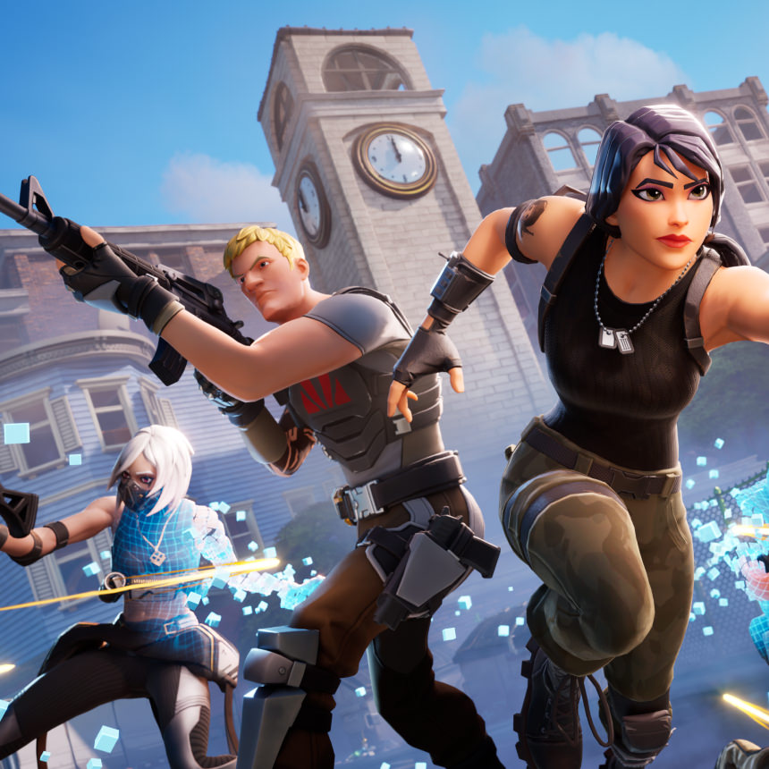

# Fortnite Reload Quest Documentation

## Quest Information

### General Details
- **Quest ID:** 1252352602092339400
- **Quest Name:** Reload
- **Game Title:** Fortnite Reload
- **Game Publisher:** Epic Games
- **Starts At:** 2024-06-27T17:00:00+00:00
- **Expires At:** 2024-07-04T23:59:59+00:00
- **Link:** [Fortnite News](https://www.fortnite.com/news/squad-up-for-fortnite-reload)

### Assets
- **Hero Image:** 
  

- **Quest Bar Hero:**
  

- **Game Tile:** 
  

- **Logotype:** 
  

### Colors
- **Primary:** `#031A69`
- **Secondary:** `#04269A`

## Task Configuration

### General
- **Type:** 1
- **Join Operator:** or

### Tasks
- **PLAY_ON_DESKTOP:**
  - **Event Name:** PLAY_ON_DESKTOP
  - **Target:** 900 seconds

## Rewards Configuration

### General
- **Assignment Method:** 1

### Rewards
- **Type:** 3
- **SKU ID:** 1252353273256480818
- **Asset:** 
  

- **Messages:**
  - **Name:** Victory Crown Avatar Decoration
  - **Name with Article:** a Victory Crown Avatar Decoration
  - **Redemption Instructions by Platform:**
    ```
    This collectible can be redeemed on Discord! Go to your Gift Inventory to redeem and equip.
    ```
- **Expires At:** 2024-09-05T17:00:00+00:00

### Platforms
- **Supported Platforms:** [0]

## User Status

### General
- **User ID:** 842220666321371168
- **Quest ID:** 1252352602092339400
- **Enrolled At:** 2024-06-27T19:34:50.559098+00:00
- **Completed At:** 2024-06-27T19:50:29.208949+00:00
- **Claimed At:** null
- **Claimed Tier:** null
- **Last Stream Heartbeat At:** null
- **Stream Progress Seconds:** 0
- **Dismissed Quest Content:** 1

### Progress
- **PLAY_ON_DESKTOP:**
  - **Value:** 900
  - **Event Name:** PLAY_ON_DESKTOP
  - **Updated At:** 2024-06-27T19:50:29.208945+00:00
  - **Completed At:** 2024-06-27T19:50:29.208949+00:00
  - **Heartbeat:**
    - **Last Beat At:** 2024-06-27T19:50:29.208912+00:00
    - **Expires At:** null

## Running Game

### Removed
- **Command Line:** `C:\Program Files\Fortnite\fortniteclient-win64-shipping.exe`
- **Executable Name:** `fortniteclient-win64-shipping.exe`
- **Executable Path:** `c:/program files/fortnite/fortniteclient-win64-shipping.exe`
- **Hidden:** false
- **Is Launcher:** false
- **ID:** 432980957394370572
- **Name:** Fortnite
- **PID:** 20127
- **PID Path:** [20127]
- **Process Name:** Fortnite
- **Start Time:** 1719516921692

## Reward Claim

### General
- **Claimed At:** 2024-06-27T19:51:49.533113+00:00

### Entitlements
- **ID:** 1255973886722572440
- **SKU ID:** 1252353273256480818
- **Application ID:** 1096190356233670716
- **User ID:** 842220666321371168
- **Deleted:** false
- **Ends At:** 2024-09-05T17:00:00+00:00
- **Type:** 10
- **Tenant Metadata:** {}
- **Gift Code Flags:** 0
- **Promotion ID:** null

### Errors
- **Errors:** []

## License
This project is licensed under the MIT License.
